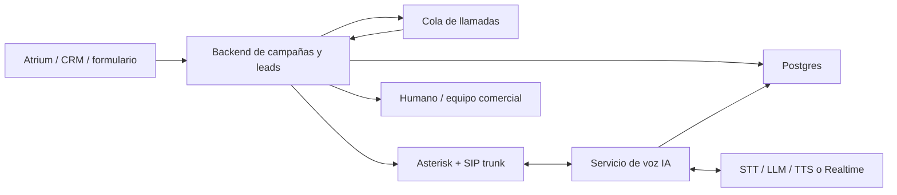

# Bot de llamadas para Atrium

Base inicial para montar una aplicacion SaaS de llamadas con IA usando Asterisk.

El producto tiene dos flujos principales:

1. Lead inbound: una persona escribe interesada en rentar una propiedad y la IA la llama para explicar la propiedad, requisitos, proceso de aplicacion y proximos pasos.
2. Lead outbound: la IA llama a propietarios o leads de Atrium para explicar el servicio, responder preguntas y calificar interes.

La recomendacion es construir primero un MVP controlado, con leads que ya dieron permiso o que vienen de una relacion previa, antes de escalar a campañas de cold calling.

## Estado actual

El repositorio ya trae un primer esqueleto desplegable:

- `frontend`: portal cliente y backoffice en Next.js.
- `backend`: API Go con endpoints iniciales y datos demo.
- `postgres`: base de datos para el producto.
- `redis`: colas y workers.
- `asterisk`: PBX con ARI, SIP y RTP preparados.
- `backend/migrations`: primer esquema SQL.
- `docs/deploy-coolify.md`: guia de despliegue en Coolify.

## Arquitectura propuesta



## Componentes

- Asterisk: PBX, SIP trunk, entrantes, salientes, grabaciones y control de canales.
- Backend: API para leads, campañas, propiedades, consentimientos, logs, resumen de llamadas y handoff a humano.
- Base de datos: leads, propiedades, propietarios, estados de llamada, transcripciones, resultado, opt-out y consentimientos.
- Worker de llamadas: decide a quien llamar, horarios permitidos, reintentos, limites por campaña y bloqueo de numeros excluidos.
- Servicio de voz IA: conecta audio de Asterisk con el proveedor de IA, maneja turnos, interrupciones, herramientas y transferencia.
- Panel web: ver leads, lanzar campañas, escuchar grabaciones, revisar transcripciones y configurar scripts.

## Integracion con Asterisk

Para el MVP hay dos opciones:

### Opcion A: ARI + External Media

Es la opcion recomendada para conversaciones naturales en tiempo real.

- El backend origina la llamada con ARI o AMI.
- Asterisk mete la llamada en una aplicacion Stasis.
- Se crea un canal External Media para enviar/recibir audio RTP desde un servicio propio.
- El servicio de voz transforma ese audio para STT/LLM/TTS o para una API realtime.
- El bot puede hablar, escuchar, interrumpir, transferir y registrar resultados.

### Opcion B: AGI/EAGI

Mas simple para un piloto muy guiado, pero peor para conversaciones naturales.

- Asterisk ejecuta scripts por llamada.
- Sirve para menus, preguntas cerradas y flujos lineales.
- No es ideal si el usuario interrumpe, cambia de tema o hace preguntas abiertas.

## MVP recomendado

Primera version:

- Solo llamadas a leads que entraron por formulario o CRM.
- Un tipo de llamada: interesado en rentar propiedad.
- Una propiedad de prueba con datos estructurados.
- Script conversacional con objetivos claros:
  - Identificarse como asistente de Atrium.
  - Confirmar que puede hablar.
  - Explicar propiedad, precio, disponibilidad y requisitos.
  - Resolver preguntas usando datos verificados.
  - Calificar: presupuesto, fecha de mudanza, ocupantes, ingresos, mascotas, interes.
  - Enviar resumen y siguiente paso por SMS/email/CRM.
  - Transferir a humano si hay alta intencion o pregunta sensible.
- Panel minimo para cargar leads y ver resultados.

Despues:

- Campañas para propietarios.
- Integracion completa con Atrium.
- Reglas de reintentos.
- Deteccion de voicemail.
- Handoff en vivo.
- Analitica de conversion.

## Guardrails imprescindibles

- La IA debe decir que es un asistente automatizado de Atrium al inicio.
- No debe inventar disponibilidad, precios, fees, requisitos legales ni condiciones.
- Si no sabe algo, debe ofrecer pasar la consulta a un humano.
- Debe respetar opt-out: si dicen "no me llames", guardar el numero como bloqueado.
- Debe registrar consentimiento/base legal para cada llamada.
- Para cold calling real, revisar normativa por pais/estado antes de activar campañas.

## Estructura sugerida del repo

```text
.
├── asterisk/
│   ├── extensions.conf
│   ├── pjsip.conf
│   └── ari.conf
├── backend/
│   ├── app/
│   └── tests/
├── voice-agent/
│   ├── app/
│   └── tests/
├── web/
├── docker-compose.yml
└── docs/
```

## Siguiente paso tecnico

El siguiente paso tecnico es conectar persistencia real y llamadas:

- aplicar migraciones en Postgres
- reemplazar datos demo por queries reales
- implementar autenticacion y `tenant_id`
- conectar el worker con Asterisk ARI
- crear `voice-agent` para audio realtime

## Desarrollo local

Backend:

```bash
cd backend
go test ./...
go run ./cmd/api
```

Frontend:

```bash
cd frontend
npm install
npm run dev
```

Docker Compose:

```bash
cp .env.example .env
docker compose up --build
```

Servicios por defecto:

- Frontend: `http://localhost:3000`
- Backend: `http://localhost:8080/healthz`
- Asterisk ARI: `http://localhost:8088/ari`

## Despliegue

La primera opcion recomendada es subir el repo a GitHub y desplegarlo en el VPS con Coolify usando Docker Compose.

Ver [docs/deploy-coolify.md](docs/deploy-coolify.md).
